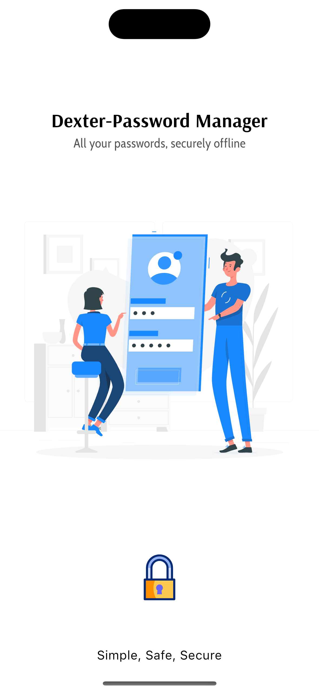
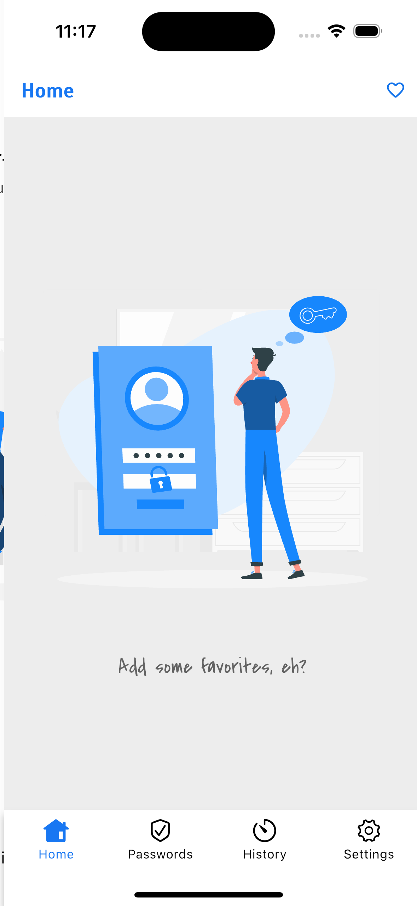
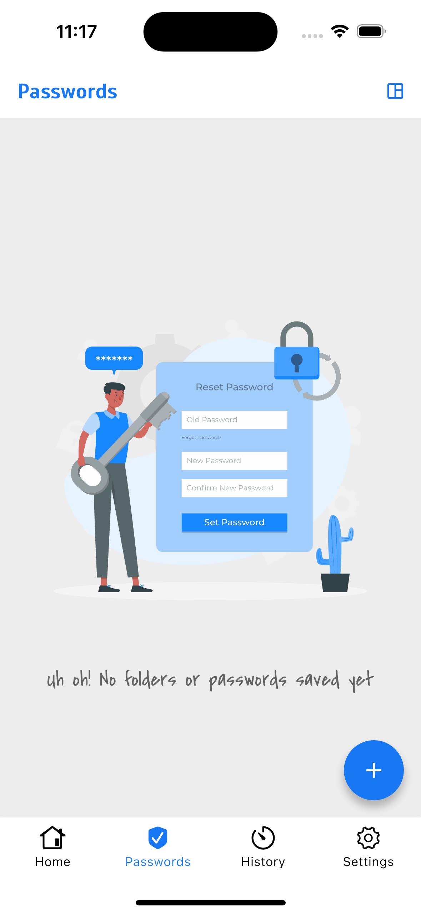
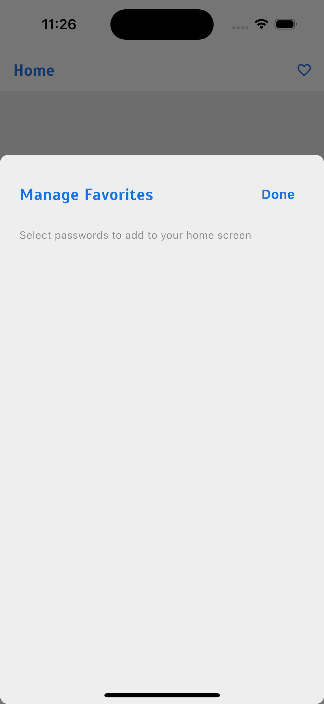
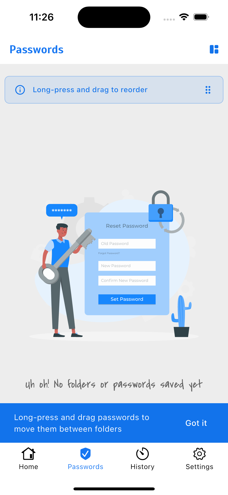
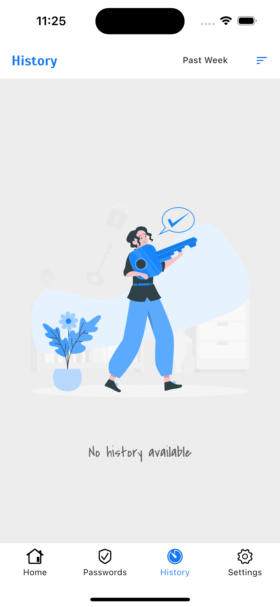
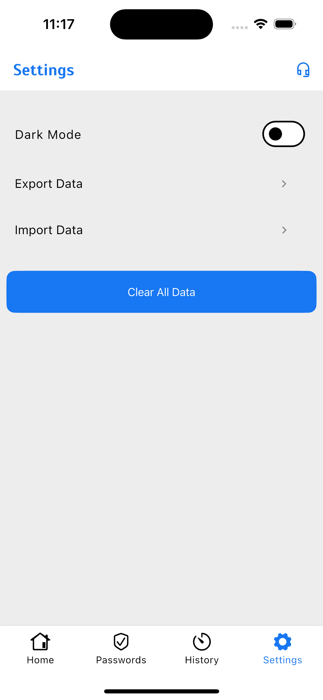

<div align="center">

# 🔐 Dexter

### Your Trusted Offline Password Manager

*In a world where everything is connected – and constantly watched – Dexter takes a different path.*

[](https://apps.apple.com/us/app/dexter-password-manager/id6738388602)
[](https://play.google.com/store/apps/details?id=com.adarsh.password_vault)
[](https://flutter.dev)
[](LICENSE)

[Features](#-features) • [Screenshots](#-screenshots) • [Download](#-download) • [Tech Stack](#-tech-stack) • [Contributing](#-contributing)

</div>

---

## 🎯 About Dexter

Your passwords stay **completely offline**, **fully encrypted**, and **entirely yours**. No servers, no tracking, no data sharing – just pure privacy and control.

> **Born out of Forgetfulness, Built for Security** 🚀  
> Ever found yourself locked out of your own accounts because you forgot a password? Wi-Fi passwords, bank PINs, online logins… That's when Dexter was born – a secure offline password manager that keeps all your sensitive info in one place.

---

## ✨ Features

### 🔒 **Truly Offline & Secure**
All your passwords are stored locally and encrypted on your device with **256-bit AES encryption**. Nothing ever leaves your phone – keeping you safe from online breaches, hackers, and AI data collection.

### 📁 **Smart Organization**
- **Folders**: Organize passwords into custom folders for work, personal, banking, and more
- **Favorites**: Mark important passwords as favorites for one-tap access
- **Search & Filter**: Quickly find any password with smart search
- **Drag & Drop**: Effortlessly reorganize passwords between folders

### 🔑 **Password Management**
- **Secure Storage**: Store passwords with website links, usernames, descriptions, and notes
- **Password Generator**: Create strong, cryptographically secure passwords with one tap
- **Visibility Toggle**: Show/hide individual passwords for extra security
- **Quick Copy**: Copy passwords to clipboard with a single tap

### 📊 **History & Tracking**
- **Activity History**: Track all password changes, additions, and deletions
- **Time-Based Filters**: View history by past week, month, or 6 months
- **Auto-Cleanup**: Automatically removes history older than 6 months

### 🔐 **Biometric Security**
- **Face ID / Touch ID** (iOS): Quick and secure access
- **Fingerprint** (Android): Biometric authentication
- **Passcode Fallback**: Always accessible with your device passcode
- **Guided Setup**: First-time setup wizard for biometric authentication

### 💾 **Backup & Restore**
- **Local Exports**: Export your encrypted data as `.json` files
- **Easy Restore**: Import your data back anytime
- **Full Control**: Your data, your backups, your timeline

### 🎨 **Customizable Experience**
- **Light & Dark Themes**: Switch themes to suit your style and reduce eye strain
- **Modern UI**: Clean, intuitive design with smooth animations
- **Responsive Design**: Optimized for phones and tablets

### 🔄 **Always Improving**
- Regular updates with bug fixes and new features
- Community-driven development
- Privacy-focused roadmap

---

## 📱 Screenshots

<div align="center">

| Launch Screen | Home Screen | Passwords | Favorites |
|:-------------:|:-----------:|:---------:|:---------:|
|  |  |  |  |

| Organizer | History | Settings |
|:---------:|:-------:|:--------:|
|  |  |  |

</div>

---

## 📲 Download

<div align="center">

### Get Dexter on Your Device

<a href="https://apps.apple.com/us/app/dexter-password-manager/id6738388602">
  
</a>
&nbsp;&nbsp;&nbsp;&nbsp;
<a href="https://play.google.com/store/apps/details?id=com.adarsh.password_vault">
  
</a>

**iOS**: Requires iOS 12.0 or later  
**Android**: Requires Android 8.0 (API 26) or later

</div>

---

## 🛠️ Tech Stack

Dexter is built with cutting-edge technologies to ensure security, performance, and reliability:

### **Frontend & Framework**
- **[Flutter](https://flutter.dev)** - Cross-platform UI framework
- **[Dart](https://dart.dev)** - Programming language
- **[Riverpod 3.0](https://riverpod.dev)** - Modern state management

### **Database & Storage**
- **[Hive](https://docs.hivedb.dev)** - Lightning-fast local database
- **256-bit AES Encryption** - Military-grade data encryption

### **Authentication**
- **[local_auth](https://pub.dev/packages/local_auth)** - Biometric authentication
- Face ID, Touch ID, Fingerprint support

### **UI/UX Libraries**
- **[flutter_speed_dial](https://pub.dev/packages/flutter_speed_dial)** - Floating action buttons
- **[flutter_svg](https://pub.dev/packages/flutter_svg)** - SVG rendering
- **[url_launcher](https://pub.dev/packages/url_launcher)** - Open links in browser

### **Utilities**
- **[file_picker](https://pub.dev/packages/file_picker)** - Import/Export functionality
- **[intl](https://pub.dev/packages/intl)** - Date formatting
- **[device_info_plus](https://pub.dev/packages/device_info_plus)** - Device information

---

## 🗺️ Roadmap

### ✅ Current Features
- [x] Offline password storage with AES-256 encryption
- [x] Folder organization and favorites
- [x] Password generator
- [x] Biometric authentication
- [x] Import/Export functionality
- [x] Activity history tracking
- [x] Light/Dark theme support
- [x] Password Strength Analyzer

### 🔮 Upcoming Features
- [ ] **Autofill Integration**: Auto-prompt passwords in other apps (Android & iOS)
- [ ] **Secure Notes**: Store encrypted text notes
- [ ] **Personal Cloud Sync**: Optional self-hosted cloud backup
- [ ] **Browser Extensions**: Chrome, Firefox, Safari extensions
- [ ] **Password Health Check**: Identify weak or reused passwords
- [ ] **Two-Factor Authentication (2FA)**: Built-in 2FA token generator
- [ ] **Breach Monitoring**: Check if passwords appear in data breaches

*Vote on features or suggest new ones by [opening an issue](https://github.com/deb-sahu/dexter/issues)!*

---

## 🤝 Contributing

We welcome contributions from the community! Whether it's bug fixes, new features, or documentation improvements.

### How to Contribute

1. **Fork the repository**
2. **Create a feature branch**
   ```bash
   git checkout -b feature/amazing-feature
   ```
3. **Commit your changes**
   ```bash
   git commit -m 'Add some amazing feature'
   ```
4. **Push to the branch**
   ```bash
   git push origin feature/amazing-feature
   ```
5. **Open a Pull Request**

### Code of Conduct
Please read my [Code of Conduct](CODE_OF_CONDUCT.md) before contributing.

### Development Guidelines
- Follow Flutter best practices
- Write clean, documented code
- Test thoroughly on both iOS and Android
- Maintain privacy-first principles

---

## 🔒 Privacy & Security

### Privacy Promise
- ✅ **No accounts required** - Use immediately without signup
- ✅ **100% offline** - No internet connection needed
- ✅ **No data collection** - We don't track, log, or analyze anything
- ✅ **No third-party services** - No analytics, no ads, no tracking
- ✅ **Open source** - Code is transparent and auditable
- ✅ **Local encryption** - 256-bit AES encryption on your device

### Security Best Practices
1. **Use strong biometric authentication**
2. **Regular backups** - Export your data periodically
3. **Keep your device secure** - Lock screen with PIN/biometric
4. **Update regularly** - Install app updates for security patches

---

## 📄 License

This project is licensed under the **MIT License** - see the [LICENSE](LICENSE) file for details.

```
MIT License

Copyright (c) 2025 Deb Adarsh

Permission is hereby granted, free of charge, to any person obtaining a copy
of this software and associated documentation files (the "Software"), to deal
in the Software without restriction, including without limitation the rights
to use, copy, modify, merge, publish, distribute, sublicense, and/or sell
copies of the Software, and to permit persons to whom the Software is
furnished to do so, subject to the following conditions:

The above copyright notice and this permission notice shall be included in all
copies or substantial portions of the Software.

THE SOFTWARE IS PROVIDED "AS IS", WITHOUT WARRANTY OF ANY KIND, EXPRESS OR
IMPLIED, INCLUDING BUT NOT LIMITED TO THE WARRANTIES OF MERCHANTABILITY,
FITNESS FOR A PARTICULAR PURPOSE AND NONINFRINGEMENT. IN NO EVENT SHALL THE
AUTHORS OR COPYRIGHT HOLDERS BE LIABLE FOR ANY CLAIM, DAMAGES OR OTHER
LIABILITY, WHETHER IN AN ACTION OF CONTRACT, TORT OR OTHERWISE, ARISING FROM,
OUT OF OR IN CONNECTION WITH THE SOFTWARE OR THE USE OR OTHER DEALINGS IN THE
SOFTWARE.
```

---

## 💬 Support & Contact

### Need Help?
- 📧 **Email**: [debadarsh7@gmail.com](mailto:debadarsh7@gmail.com)
- 🌐 **Website**: [theadarsh.dev](https://theadarsh.dev)
- 🐛 **Bug Reports**: [GitHub Issues](https://github.com/deb-sahu/dexter/issues)
- 💡 **Feature Requests**: [GitHub Discussions](https://github.com/deb-sahu/dexter/discussions)

### Stay Updated
- ⭐ **Star this repo** to show your support
- 👀 **Watch** for updates and releases
- 🍴 **Fork** to contribute your own features

---

<div align="center">

### Your passwords deserve privacy. Dexter makes sure they have it. 🔐

**Made with ❤️ and a lot of ☕**

[⬆ Back to Top](#-dexter)

</div>
